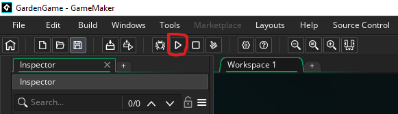

# Garden Game

TODO ReadMe füllen

## Debugging & Building

This game 🎮 is developed with passion 💖 using the GameMaker game engine. [Get your download here](https://gamemaker.io/en/download)
After installation simply open the `GardenGame.yyp` project file

To start the current version simply start the game by clicking `Run ▶` at the top or pressing `F5`.

